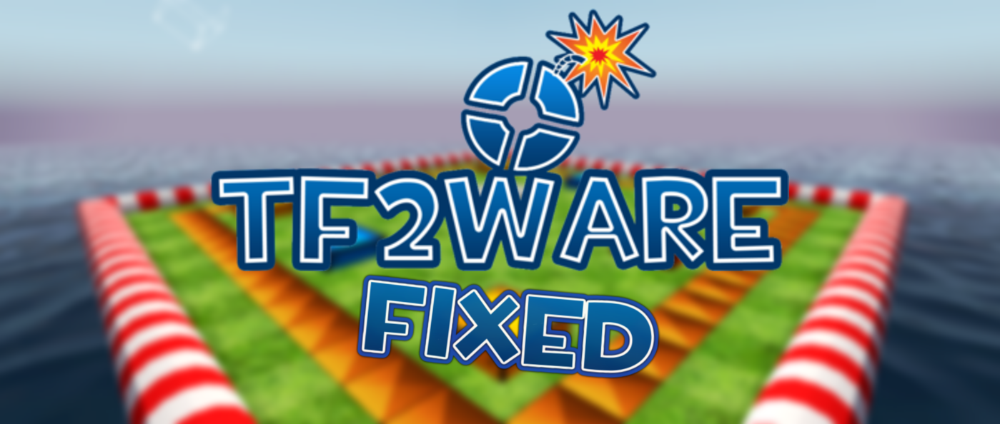

# TF2 Ware Fixed
 </img>

This is a modification of the famous "TF2 Ware" made by "Tony Baretta" that imitated the Nintendo game "Wario Ware", which eventually no longer had support and glitches occurred over time.
> [!IMPORTANT]\
> ***Still in beta, we still need to fix things in the mode, but it is already considered compatible and playable!***

# New Changelog
- Fixed weapons not being given to users when in micro game "Hit the Enemy" "Taunt Kill" "Parachute" "Pickup Plate".
- Fixed where passtime in micro game, "Break The Passtime", didn't work. (didn't give weapons)
- Fixed where the blue and red boats in the "Pirate Attack" micro game had buggy collisions.
- Fixed in the "Spycrab Limbo" micro game makes players freeze in mid-air, giving the player a soft lock bug.
- The plugin no longer supports "Send Proxy" and has been removed from gamemode.
- Swapping "TF2 Items" to "Gimme" for Optimization and Time Saving.
- The gamemode is compilable again.
- Updating script syntax to latest.

# Next Updates
- Bringing back the gamemode training hud.
- Re-enable "ww_trhud" ConVar again.
- Bringing back old TF2 Ware maps and TF2 Ware versions.

# Install

#### TF2 Ware Assets
We have archived the necessary files from Wayback Machine to run TF2 Ware for your server, you can install it within our repository and use it to play the mode.

#### Dependencies.
You need to install some dependencies to be able to run gamemode as it should be, it also equals to compilation.
- [Sourcemod 1.12+](https://www.sourcemod.net/downloads.php)
- [Gimme (Replaced TF2 Items Give Weapon)](https://forums.alliedmods.net/showthread.php?p=2766587)
- [Steam Works](https://users.alliedmods.net/~kyles/builds/SteamWorks/)
- [TF Econ Data](https://github.com/nosoop/SM-TFEconData/releases)
- [TF2 Attributes](https://github.com/FlaminSarge/tf2attributes/releases)

#### Database Setup
In order to activate Rank on your TF2 Ware server, you need to create a database in MySQL.

The gamemode needs MySQL to work, but you can choose not to have the TF2 Ware Rank by just disabling the command "ww_sql" > "0" and continue without saving your scores.

```
"tf2ware_rank"
{
	"driver" "mysql"
	"host" "yourhost"
	"database" "yourdatabase"
	"user" "username"
	"pass" "password"
	"port" "3306"
}

Table is autogenerated and autoupdate in case new games are added
```

#### Map settings
You can leave the TF2 Ware map settings as you wish, but we will share the map settings to prevent future issues involving Gamemode gameplay.

Create a CFG named "tf2ware2_a4.cfg" in your server or game's CFG folder with this commands.
```
sm plugins mw_tf2ware.smx

mp_disable_respawn_times 0
mp_friendlyfire 0
mp_match_end_at_timelimit 1

mp_autoteambalance 0
mp_scrambleteams_auto 0
mp_teams_unbalance_limit 0
```
# Convars

| **ConVars**               | **Default Value** | **Description**                                                                 |
|---------------------------|-------------------|---------------------------------------------------------------------------------|
| `ww_enable`               | `1`               | Enables/Disables TF2 Ware.                                                      |
| `ww_force`                | `0`               | Force a certain minigame (0 to not force).                                      |
| `ww_speed`                | `1.0`             | Speed level.                                                                    |
| `ww_music_fix`            | `0`               | Apply music fix? Should only be on for localhosts during testing                |
| `ww_log`                  | `0`               | Log server events?                                                              |
| `ww_special`              | `0`               | Next round is Special Round?                                                    |
| `ww_gamemode`             | `-1`              | Gamemode -1 disable                                                             |
| `ww_advert`               | `120.0`           | Time interval in seconds between notifications (0 for none)                     |
| `ww_sql`                  | `1`               | enable rank with sql table?                                                     |
| `ww_hlstatsx`             | `0`               | enable HLSTATSX points? (def 0 )                                                |
| `ww_skybox`               | `1`               | Enable Dynamic Skybox based on server time                                      |
| `ww_skybox_more`          | `1`               | Enable more skyboxes in differents hours  ww_skybox 1 needed                    |
| `ww_disabletaunts`        | `0`               | Disable Taunts 1 disable                                                        |
| `ww_snowballs`            | `0`               | Enable snowball?                                                                |
| `ww_force_special`        | `0`               | Forces a specific Special Round on Special Round                                |

# **Enjoy the plugin!**
***All credits to the original creator: "Tony Baretta"***

[](https://discord.gg/xftqrvZSAw)
